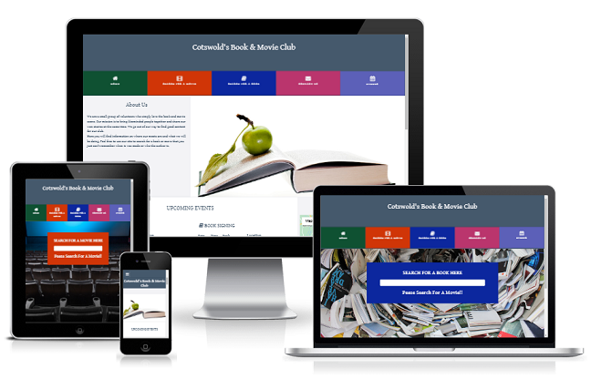
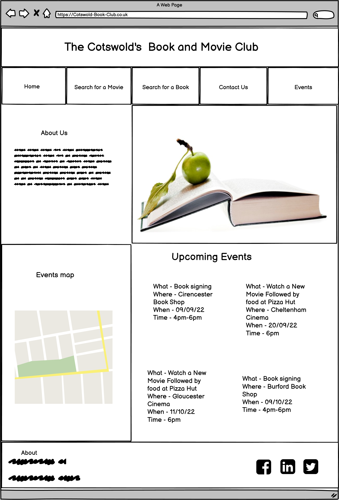
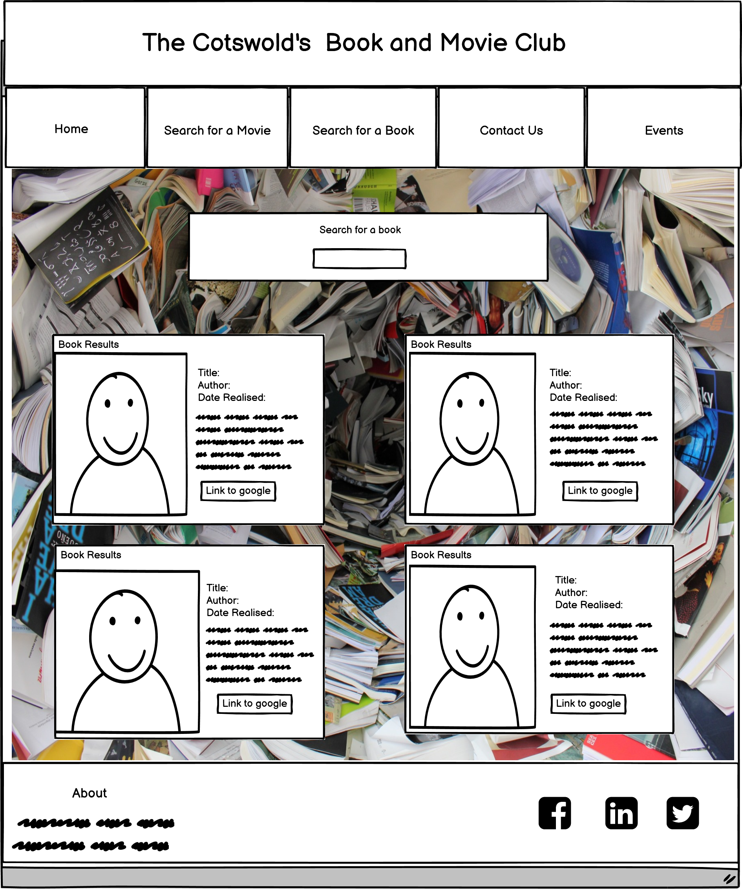
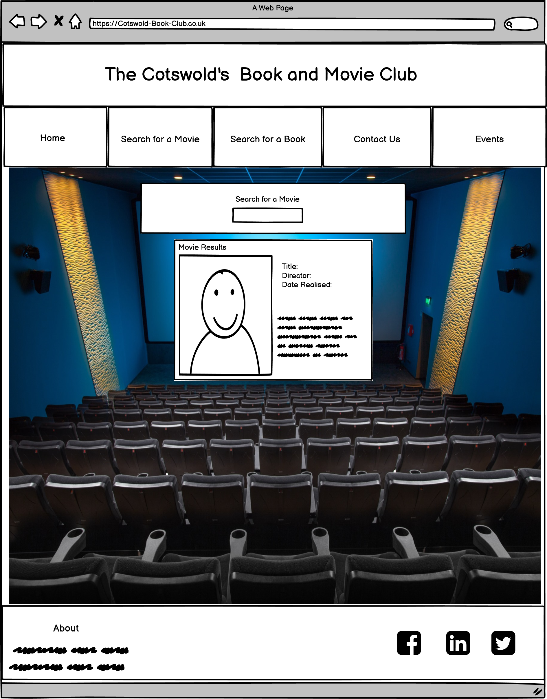
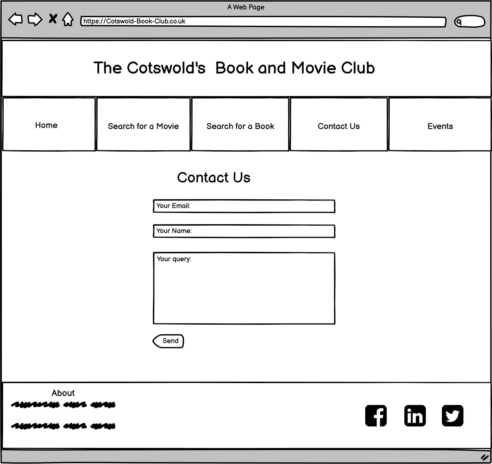

<h1 align="center">Cotswold’s Book & Movie Club</h1>

## A responsive book and movie club website for keen enthusiast visiting or living in the Cotswold’s.
***
## Code Institute – HTML/CSS/JavaScript -Interactive front end development milestone project 2.
***
## [Click Here To View The Live Project](https://ed-whyatt.github.io/cotswold-book-and-movie-club-ms2/)
***
## 
***
## UX user experience
***
## User stories
- ### First time user goals
    1. As a First Time User, I want to see information on the events and when the next event is on and where.
    2. As a First Time User, I want to navigate the website easily and interact with the content.
    3. As a First Time User, I want to easily navigate to make an enquiry.
    4. As a First Time User, I want to sign up to the newsletter.
    5. As a First Time User, I want to easily navigate to the movie search page.
    6. As a First Time User, I want to easily navigate to the book search page.
- ### Returning user goals
    1. As a Returning User, I want to see if all the upcoming book and movie events
    2. As a Returning User, I want to send a contact message.
    3. As a Returning User, I want to navigate to the club’s social media.
    4. As a Returning User, I want to see book of the month.
- ### Frequent user goals
    1. As a Frequent user, I want to easily search for a book.
    2. As a Frequent user, I want to easily sech for a movie.
    3. As a Frequent user, I want to see the current book and movie events.

# Design

## Design Introduction
- ### This website is designed for users who are interesting in joining the events of the book and movie club, they will also be able to search for books, movies and see where the events take place on Google maps. I want to make this website book and movie orientated using related images and bright colours in the navigation bar.
## Colour Scheme

- ### [Color Mind](http://colormind.io/) : Colormind has been used to aid the desision the colour sceme for the project.

### The main colours used in this website are:
- #### Navgation buttons
#### The five navgation buttons Home, Movie Search, Book Search, Contact Us and events: 
### 
- #### The main colors used for text and backgrouds:
### 

## Typography:
- ### The fonts use throughout this website are:
1. Gentium Book Basic with a fall back of sans serif.
## Imagery
###  Imagery is very important to give the user instant understating of what to expect to gain from this website. I have used book and move theatre inspiring images. The images for Book and Movie serach pages are provided by the api libaries.
- ### The main images are:
1. Main page Hero image of a [green apple on a book](assets/images/book-apple-image.png) from [https://www.stockvault.net](https://www.stockvault.net/photo/128129/book-and-apple). 
2. Book search page image of [swirling books ](assets/images/search-book-image.png) link to image at [https://pixabay.com](https://pixabay.com/photos/book-notebook-learning-learn-1171564/).
3. Movie search page image of a [blue movie theatre](assets/images/search-movie-image.png) link to image [https://pixabay.com](https://pixabay.com/photos/movie-theater-room-movie-2502213/).
4. Both the [book place holder](assets/images/book-search-placeholder.jpg) and  [movie place holder](assets/images/movie-paceholder.png) images that are used when the searches have no images have come from [https://pixabay.com](https://pixabay.com).
## Wireframes

- ### Large screens

1. Home Page Wireframe 

2. Book App Page Wireframe 

3. Movie App Page Wireframe 

4. Contact Page Wireframe 

- ### Medium Screens click to view

1. Medium View Home Page Wireframe - [view](documentation/wireframes/medium-club-wf.png)
2. Medium Book App Page Wireframe - [view](documentation/wireframes/medium-club-book-wf.png) 
3. Medium Movie App Page Wireframe - [view](documentation/wireframes/medium-club-movie-wf.png) 
4. Medium contact Page wireframe - [view](documentation/wireframes/medium-club-contact-wf.png)

- ### Small Screens click to view
1. Small Home Page Wireframe - [view](documentation/wireframes/club-small-home-wf.png) 
2. Small Book App Page Wireframe - [view](documentation/wireframes/club-small-book-wf.png)
3. Small Movie App Page Wireframe - [view](documentation/wireframes/club-small-movie-wf.png)
4. Small Contact Page Wireframe - [view](documentation/wireframes/club-small-contact-wf.png)
# Features
Am I Responsive has been used for the responsie image at the top of README.md you can view there website below and interatct with this project on each device.
-   ### Responsive on all devices - [view](https://ui.dev/amiresponsive?url=https://ed-whyatt.github.io/cotswold-book-and-movie-club-ms2/)

## Interactive elements. NO LINKS YET !!!!!!
- Interactive elements.
1. Navagation has links to Home, Search for a Movie, Search for abook and Events.
 
2. Intractiove navgation menu when viewd on small devices.
 
3. Footer with links to social media.
4. Footer on small devices.
5. Events map.
6. Book search.
7. Book search results.
8. Book search link opens in new window.
9. Movie search.
10. contact us page contact request form sends email when submitted.
- Other features include
1. About us section on home page.
2. Events section on home page.

## Technologies Used
### Languages Used
-   [HTML5](https://en.wikipedia.org/wiki/HTML5)
-   [CSS3](https://en.wikipedia.org/wiki/Cascading_Style_Sheets)
-   [JavaScript](https://en.wikipedia.org/wiki/JavaScript)
### Frameworks libraries and programming interface
1. [Bootstrap 5.2.0:](https://getbootstrap.com/docs/5.2/getting-started/introduction/)
    - Bootstrap was used to assist with the responsiveness and styling of the website.
1. [Google Fonts:](https://fonts.google.com/)
    - Google fonts were used to import the 'Lato', 'Poppins' and 'Pacifico' fonts into the style.css file which is used on all pages throughout the project.
1. [Font Awesome:](https://fontawesome.com/)
    - Font Awesome was used on all pages throughout the website to add icons for aesthetic and UX purposes.
1. [jQuery:](https://jquery.com/)
    - jQuery came with Bootstrap to make the navbar responsive but was also used for the smooth scroll function in JavaScript.
1. [Git](https://git-scm.com/)
    - Git was used for version control by utilizing the Gitpod terminal to commit to Git and Push to GitHub.
1. [GitHub:](https://github.com/)
    - GitHub is used to store the projects code after being pushed from Git.
1. [Balsamiq:](https://balsamiq.com/)
    - Balsamiq was used to create the [wireframes](#)  (NO LINK!!!!!) during the design process.
1. [Hover.css:](http://ianlunn.github.io/Hover/)
    - Hover.css is used for the hover effects on the navgation buttons.
1. [Am I Responsive Design:](http://ami.responsivedesign.is/)
    - Am I Responsive Design was used for the responsive image in Readme.
1. [Preloaders at icons8.com](https://icons8.com/preloaders/en/search/bar)
    - Preloaders was used for the search loading bar in the book and movie search pages.

### API Application Programming Interfaces used:
 1. [Google Maps API](https://developers.google.com/maps/documentation/javascript/marker-clustering?hl=en#maps_marker_clustering-javascript)
    - Google Maps API is used for the map and the map clusters in the events map section of the home page. 
1. [Google Books API](https://developers.google.com/books/docs/v1/using#PerformingSearch)
    - Google Books API is used for the book seach app in the book search page.
1. [OMDb API](http://www.omdbapi.com/)
    - OMDb API is used for the book search app in the book search page.

## Testing
## JEST
- ### Jest: [https://jestjs.io/](https://jestjs.io/)
1. ### Initialising Jest
#### In terminal in GitPod.io workspace type:
    npm init
#### Click enter untill you get to test command and type jest:
    test command: jest
#### Then keep clicking enter untill the end when is display yes click and  enter to install jest.
2. ### Installing Jest
#### In the terminal in GitPod.io workspace type:
     npm install ---save-dev jest@26.6.3
#### Click enter and it will install. For a more detailed exapmle go to [Jest: Documentation](https://jestjs.io/docs/getting-started).
3. ### Using Jest
### I will be useing Jest to do some tests on the navgation app only this is a key function in the use of the website in a mobile view. I fully acknowledge and understand that, in a real-world scenario, an extensive set of Jest tests would be more comprehensive.
- Testing the Dom research in using Jest [Documentation](https://jestjs.io/docs/tutorial-jquery)
   - Jest Tests done in git enviroment.
   1. Mock HTML file for testing purposes.
      ### 
   2. Jest code used for testing the DOM of the button click function used in the navgation app.
   - ### nav-toggle-app.js 
     ### 
   - ### nav.toggle.app.test.js
     ### 
   4. Get Jest test results by typing npm test in the terminal while in the git enviroment.
                 
          npm test

      ### 

## W3C Markup Validator - [Link to site](https://validator.w3.org/#validate_by_uri).
The W3C Markup Validator and W3C CSS Validator Services were used to validate every page of the project to ensure there were no syntax errors in the project. The most substantial bugs that were fixed are in the bu fixed section below testing in README.md.

-   ### [W3C Markup Validator](https://validator.w3.org/#validate_by_uri)

-   ### Home page 
1. Initial test.
    ### 
2. Test after bugs fixed.
    ### 

-   ### Movie Search Page 
1. Initial test.
    ### 
2. Test after bugs fixed.
    ### 

-   ### Book Search Page
1. Initial test.
    ### 
2. Test after bugs fixed.
    ### 

-   ### contact Us
1. Initial test no bugs to fix after test was done.
    ### 
-   ### [W3C CSS Validator](https://jigsaw.w3.org/css-validator/#validate_by_input)
2. Test after the needed bugs fixed.
    ### 

## JSHint - [Link to site](https://jshint.com/)
JSHint  Services were used to validate every JavaScript page of the project to ensure there were no major syntax errors in the project. The most substantial bugs that were fixed are in the bu fixed section below testing in README.md.

### Book search App
1.  Initial test.
## 
2. Test after needed bugs fixed.
## 

### Maps - [link to documentation](https://developers.google.com/maps/documentation/javascript/marker-clustering)
1.  Maps test, I decide not to change anything as most of the code is from the documentation.
### 

### Movie app
1.  Initial test.
### 
2. Test after the needed bugs fixed in bugs fixed section below.
### 

### Nav toggle App
1.  Initial test.
### 
2. Test after the needed bugs fixed in bugs fixed section below.
### 

### Send Email
### 

## Google Chrome Developer Tools
Google Chrome Developer Tools has been used throughout the development of this page, To use it in Google Crome browser Right click anywhere on the screen and click inspect on the menu.

### Google Chrome Developer Tool Lighthouse results
#### Home Page
1.  Initial test.
### 
2. Test after bugs fixed and genral inprovments.
### 

#### Search For Movie Page
1.  Initial test.
### 
2. Test after bugs fixed and genral inprovments.
### 

#### Search for Book Page
1.  Initial test.
### 
2. Test after bugs fixed and genral inprovments.
### 

#### Contact Us Page
1.  Initial test.
### 
2. Test after bugs fixed and genral inprovments.
### 

Some tests that lighthouse testing revealed are external and i have not changed them here are some that stand out.
1. The JQuary library shows as a medium securty risk.
### 
2. 
The Google Maps Street view image displays with incorrect aspect ratio.
### 

## Bugs Fixed
1. Color contrast
### The colors chosen for the Home and Search for Movie navgation button where of to low contract and have been changed.
- Before fix:
####  
- After fix:
####  
- Navgation colors after fix:
#### 
2. The locations in the up comming events section where flowing out of the container when viewed on an extra small screen on all events. I put the locations section in its own collum to prevent this.
- Before fix
####  ####
- After fix 
####  ####
3. There was a gap on the right hand side of every page that was causing the page to show an unwanted horizontal scroll bar.
- Before fix same code for all pages.
####  #### 
- After fix same code for all pages.
####  #### 
4. The discription in the book search results displayed was to long so i oraginally put a slice function in to reduce the size. Crome devlpoment tools showd an error, so i changed the information displayed to the book text snippet instend of the book description in the array of results from the Google Book API.
- Book search Crome devlpoment tool error. And changed 
#### 
- Code before fix in book-app.js
####  
#### 
- Code after fix in book-app.js
####  
####  
5.
- Before fix
####  ####
- After fix
####  ####git status

## Further testing
- 

### Testing User Stories from User Experience (UX) section

## Known bugs
-  book and movie search lots of text - loader continues
## Testing User Stories from User Experience (UX) Section
-
-
## Changes made after UX, Design and Wireframes 
- 
## Credits
 - ### Tutorials used
    - ####  Google Cluster Maps for maps.js
      #### Google maps cluster documentation - [view](https://developers.google.com/maps/documentation/javascript/marker-clustering)
    - #### root tech How to Program Web App Using Google Book API used to help with book-app.js
      #### root tech YouTube - [view](https://www.youtube.com/watch?v=uaMMkaa-P_A&list=PLv3FkN9_9-cvHY-oSLsSFL9OwRalG793b&index=2)
    - #### Coding Shiksha Build a Movie Info App in Javascript and Boostrap Using OMDb API used to help with movie-app.js     
      #### Coding Shiksha Youtube - [view](https://www.youtube.com/watch?v=8iuPNq553U0)

## Acknowledgments
- 
