<h1 align="center">Cotswold’s Book & Movie Club</h1>

## A responsive book and movie club website for keen enthusiast visiting or living in the Cotswold’s.
***
## Code Institute – HTML/CSS/JavaScript -Interactive front end development milestone project 2.
***
## [Click Here To View The Live Project](https://ed-whyatt.github.io/cotswold-book-and-movie-club-ms2/)
***
## 
***
## UX user experience
***
## User stories
- ### First time user goals
    1. As a First Time User, I want to see information on the events and when the next event is on and where.
    2. As a First Time User, I want to navigate the website easily and interact with the content.
    3. As a First Time User, I want to easily navigate to make an enquiry.
    4. As a First Time User, I want to sign up to the newsletter.
    5. As a First Time User, I want to easily navigate to the movie search page.
    6. As a First Time User, I want to easily navigate to the book search page.
- ### Returning user goals
    1. As a Returning User, I want to see if all the upcoming book and movie events
    2. As a Returning User, I want to send a contact message.
    3. As a Returning User, I want to navigate to the club’s social media.
    4. As a Returning User, I want to see book of the month.
- ### Frequent user goals
    1. As a Frequent user, I want to easily search for a book.
    2. As a Frequent user, I want to easily sech for a movie.
    3. As a Frequent user, I want to see the current book and movie events.

# Design

## Design Introduction
- ### This website is designed for users who are interesting in joining the events of the book and movie club, they will also be able to search for books, movies and see where the events take place on Google maps. I want to make this website book and movie orientated using related images and bright colours in the navigation bar.
## Colour Scheme

- ### [Color Mind](http://colormind.io/) : Colormind has been used to aid the desision the colour sceme for the project.

### The main colours used in this website are:
- #### Navgation buttons
#### The five navgation buttons Home, Movie Search, Book Search, Contact Us and events: 
### 
- #### The main colors used for text and backgrouds:
### 

## Typography:
- ### The fonts use throughout this website are:
1. Gentium Book Basic with a fall back of sans serif.
## Imagery
###  Imagery is very important to give the user instant understating of what to expect to gain from this website. I have used book and move theatre inspiring images. The images for Book and Movie serach pages are provided by the api libaries.
- ### The main images are:
1. Main page Hero image of a [green apple on a book](assets/images/book-apple-image.png) from [https://www.stockvault.net](https://www.stockvault.net/photo/128129/book-and-apple). 
2. Book search page image of [swirling books ](assets/images/search-book-image.png) link to image at [https://pixabay.com](https://pixabay.com/photos/book-notebook-learning-learn-1171564/).
3. Movie search page image of a [blue movie theatre](assets/images/search-movie-image.png) link to image [https://pixabay.com](https://pixabay.com/photos/movie-theater-room-movie-2502213/).
4. Both the [book place holder](assets/images/book-search-placeholder.jpg) and  [movie place holder](assets/images/movie-paceholder.png) images that are used when the searches have no images have come from [https://pixabay.com](https://pixabay.com).
## Wireframes

- ### Large screens

1. Home Page Wireframe 

2. Book App Page Wireframe 

3. Movie App Page Wireframe 

4. Contact Page Wireframe 

- ### Medium Screens click to view

1. Medium View Home Page Wireframe - [view](documentation/wireframes/medium-club-wf.png)
2. Medium Book App Page Wireframe - [view](documentation/wireframes/medium-club-book-wf.png) 
3. Medium Movie App Page Wireframe - [view](documentation/wireframes/medium-club-movie-wf.png) 
4. Medium contact Page wireframe - [view](documentation/wireframes/medium-club-contact-wf.png)

- ### Small Screens click to view
1. Small Home Page Wireframe - [view](documentation/wireframes/club-small-home-wf.png) 
2. Small Book App Page Wireframe - [view](documentation/wireframes/club-small-book-wf.png)
3. Small Movie App Page Wireframe - [view](documentation/wireframes/club-small-movie-wf.png)
4. Small Contact Page Wireframe - [view](documentation/wireframes/club-small-contact-wf.png)
# Features
Am I Responsive has been used for the responsie image at the top of README.md you can view there website below and interatct with this project on each device.
-   ### Responsive on all devices - [view](https://ui.dev/amiresponsive?url=https://ed-whyatt.github.io/cotswold-book-and-movie-club-ms2/)

## Interactive elements. NO LINKS YET !!!!!!
- Interactive elements.
1. Navagation has links to Home, Search for a Movie, Search for abook and Events.
 
2. Intractiove navgation menu when viewd on small devices.
 
3. Footer with links to social media.
4. Footer on small devices.
5. Events map.
6. Book search.
7. Book search results.
8. Book search link opens in new window.
9. Movie search.
10. contact us page contact request form sends email when submitted.
- Other features include
1. About us section on home page.
2. Events section on home page.

## Technologies Used
### Languages Used
-   [HTML5](https://en.wikipedia.org/wiki/HTML5)
-   [CSS3](https://en.wikipedia.org/wiki/Cascading_Style_Sheets)
-   [JavaScript](https://en.wikipedia.org/wiki/JavaScript)
### Frameworks libraries and programming interface
1. [Bootstrap 5.2.0:](https://getbootstrap.com/docs/5.2/getting-started/introduction/)
    - Bootstrap was used to assist with the responsiveness and styling of the website.
1. [Google Fonts:](https://fonts.google.com/)
    - Google fonts were used to import the 'Lato', 'Poppins' and 'Pacifico' fonts into the style.css file which is used on all pages throughout the project.
1. [Font Awesome:](https://fontawesome.com/)
    - Font Awesome was used on all pages throughout the website to add icons for aesthetic and UX purposes.
1. [jQuery:](https://jquery.com/)
    - jQuery came with Bootstrap to make the navbar responsive but was also used for the smooth scroll function in JavaScript.
1. [Git](https://git-scm.com/)
    - Git was used for version control by utilizing the Gitpod terminal to commit to Git and Push to GitHub.
1. [GitHub:](https://github.com/)
    - GitHub is used to store the projects code after being pushed from Git.
1. [Balsamiq:](https://balsamiq.com/)
    - Balsamiq was used to create the [wireframes](#)  (NO LINK!!!!!) during the design process.
1. [Hover.css:](http://ianlunn.github.io/Hover/)
    - Hover.css is used for the hover effects on the navgation buttons.
1. [Am I Responsive Design:](http://ami.responsivedesign.is/)
    - Am I Responsive Design was used for the responsive image in Readme.
1. [Preloaders at icons8.com](https://icons8.com/preloaders/en/search/bar)
    - Preloaders was used for the search loading bar in the book and movie search pages.
1. [obfuscator](https://obfuscator.io/)
   - The obfuscator website was used to create a hidden API key in the movie search app.

### API Application Programming Interfaces 
***
#### API's used:
There are five API's used in this website:
 1. [Google Maps API](https://developers.google.com/maps)
    - Google Maps API is used for the map and the map clusters in the events map section of the home page. 
1. [Google Books API](https://developers.google.com/books)
    - Google Books API is used for the book seach app in the book search page.
1. [OMDb API](http://www.omdbapi.com/)
    - OMDb API is used for the book search app in the book search page.
1. [Email.js](https://www.emailjs.com)
    - Email.js is used to recive contact requests in the contact us page.
1. [https://jquery.com/](https://jquery.com/)
    - jquary is used on the the book search app book-app.js and movie search app movie-app.js.

### API keys: 
You will need you own api keys to use the APIs correctly.
#### Google Maps key 
***
- The Google Maps key is located on the bottom of the home page index.html - The google maps api key documntation can be found at [link to documtation](https://developers.google.com/maps/documentation/javascript/get-api-key).

#### Creating an API key

1. Go to the Google Maps Platform > Credentials page [link to the Credentials page](https://console.cloud.google.com/projectselector2/google/maps-apis/credentials).
2. On the Credentials page, click Create credentials > API key.
The API key created dialog displays your newly created API key.
3. Click Close.
The new API key is listed on the Credentials page under API keys.
(Remember to restrict the API key before using it in production.)
4. Go to the bottom of the index.html page and add your new key in.
- You must include an API key with every Maps JavaScript API request. In the following example, replace YOUR_API_KEY with your API key.

      <script async defer src="https://maps.googleapis.com/maps/api/js?key=YOUR_API_KEY&callback=initMap"></script>


#### Restricting API keys
1. Go to the Google Maps Platform > Credentials page [link to the Credentials page](https://console.cloud.google.com/projectselector2/google/maps-apis/credentials).
2. Select the API key that you want to set a restriction on. The API key property page appears.
3. Under Key restrictions, set the following restrictions:
    - Application restrictions:
    1. To accept requests from the list of website that you supply, select HTTP referrers (web sites) from the list of Application restrictions.
    2. Specify one or more referrer web sites. For example, *.google.com accepts all sites ending in google.com, such as https://developers.google.com.
    Note: file:// referers need a special representation to be added to the key restriction. The "file://" part should be replaced with "__file_url__" before being added to the key restriction. For example, "file:///path/to/" should be formatted as "__file_url__//path/to/*". After enabling file:// referers, it is recommended you regularly check your usage, to make sure it matches your expectations.
    -  API restrictions:
    1. Click Restrict key.
    2. Select Maps JavaScript API from Select APIs dropdown. If the Maps    JavaScript API is not listed, you need to enable it.
    3. If your project uses Places Library, also select Places API. Similarly, if your project uses other services in the JavaScript API (Directions Service, Distance Matrix Service, Elevation Service, and/or Geocoding Service), you must also enable and select the corresponding API in this list.
4. To finalize your changes, click Save.

5. Adding the API key to your request.
   - You must include an API key with every Maps JavaScript API request. In the following example, replace YOUR_API_KEY with your API key.

         <script async defer src="https://maps.googleapis.com/maps/api/js?key=YOUR_API_KEY&callback=initMap"></script>


#### Movie OMDB API
*** 
- The Movie OMDB API key is located in the movie-app.js file - The Movie OMDB API key documtation can be found at [link to documtation](http://www.omdbapi.com/).

#### Creating an API key

1. Go to The Open Movie Database page [link to page](http://www.omdbapi.com/) and click on API key [link to API page](http://www.omdbapi.com/apikey.aspx).
2. On the API page fill in your details in the form and click submit.
3. You will be e-mailed your key.
4. Go to the apikey in the movie-app.js file and replace the ```apiKey()``` with your key.
```javascript
           $.getJSON("https://www.omdbapi.com/?", {
            apikey: YOUR KEY HERE,
            s: search
        }, function (data) {
            if (data.Search !== undefined) {
                $.each(data.Search, function (index, value) {
                    if (index < 4) {
                        $.getJSON("https://www.omdbapi.com/?", {
                            apikey: YOUR KEY HERE,
                                i: value.imdbID
                            },
```
***
### EMail.js
*** 
 The MEMail.js key is located in the send-email.js file - The EMail.js key documtation can be found at [link to documtation](https://www.emailjs.com/docs/):

 #### Creating an API key

1. Go to the Eamil.js page [link to page](https://dashboard.emailjs.com/sign-up) fill out the sign up form and click on sign up.
2. Once signed up log into your account to use the email you will need two keys the public key and email service id.
3. To get the public key click on accout in the Email.js dashboard [link to account dashbord](https://dashboard.emailjs.com/admin/account) then click on genral and the public key is under API keys.
4. To get the service key click on email services in the Email.js dashboard [link to services dashbord](https://dashboard.emailjs.com/admin). Click on add new service and add the email you want the messages to be sent to.
5. Then create an email template by clicking on email templates in Email.ja dashbourd [link to email templates](https://dashboard.emailjs.com/admin/templates)
6. Within the email template put the email you used in step four and put Cotswold_Club it the Form Name feild.
7. Now in the send-email.js file replace YOUR_SERVICE_KEY with your service key in step 3 and replace PUBLIC_KEY with your public key in step 4.
``` javascript 
emailjs.send("YOUR_SERVICE_KEY", "Cotswold_Club", templateParams, "PUBLIC_KEY")
```

#### Google Books and jquary 
- You do not need a key for google books or jquary.
***
## Testing
### Testing is in TESTING.md - [Link to TESTING.md](TESTING.md)
***
## Bugs Fixed
1. Color contrast
### The colors chosen for the Home and Search for Movie navgation button where of to low contract and have been changed.
- Before fix:
####  
- After fix:
####  
- Navgation colors after fix:
#### 
2. The locations in the up comming events section where flowing out of the container when viewed on an extra small screen on all events. I put the locations section in its own collum to prevent this.
- Before fix
####  
- After fix 
####  
3. There was a gap on the right hand side of every page that was causing the page to show an unwanted horizontal scroll bar.
- Before fix same code for all pages.
####  
- After fix same code for all pages.
####  
4. The discription in the book search results displayed was to long so i oraginally put a slice function in to reduce the size. Crome devlpoment tools showd an error, so i changed the information displayed to the book text snippet instend of the book description in the array of results from the Google Book API.
- Book search Crome devlpoment tool error in console.
#### 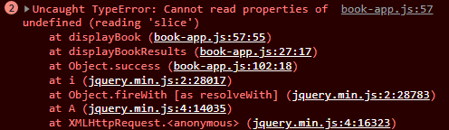
- Code before fix in book-app.js
#### 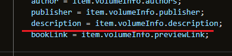 
#### 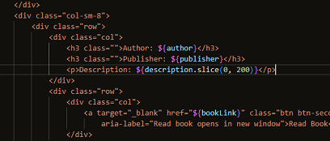
- Code after fix in book-app.js
#### 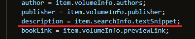 
#### 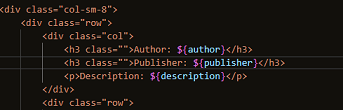 
5. Crome Dev Tool showed a readbility issue with the search bar in both the movie and book search pages. Im removed the h1 heading and used the label for the heading changes are the same for both pages.
- Crome Dev Tool Readabilty
#### 
- Before fix
#### 
- After fix
#### 
6. Crome Dev Tool showed type error when raeding textSnippet form the Google Book API results array. I Added some Ternary statement withing the html code to be displayed in the book-app.js, so it would have a flallback message when no results are found.
- Book search Crome devlpoment tool error in console.
#### 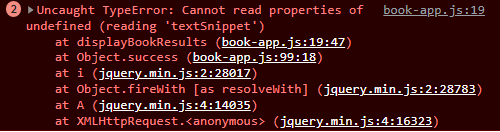
- Before fix
#### 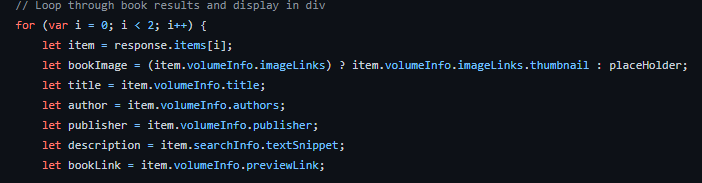
- After fix
#### 
7. Crome Dev Tool showed a Get http 404 error from the image in the movie-app.js when the OMDb Api movie poster was called so i added some Ternaty statments to the poster results for a fall back placeholder image to show.
- Book search Crome devlpoment tool error in console.
   #### 
- Before fix
   #### 
- After fix
   #### 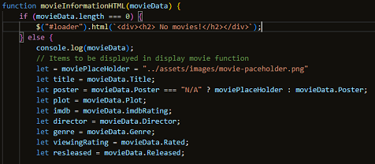
8. The heading and footer took up too much realastate on the page in small devie view so i changed the html with bootstrap collums and css useing media quaries.
- Small view and css before fix
  #### 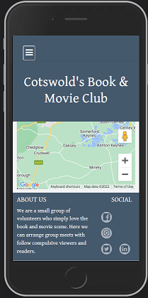 
- Html Changes
  #### 
- Small view and css that media quaries will change at max width 500px.
  #### 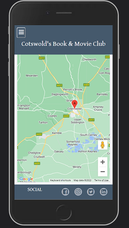 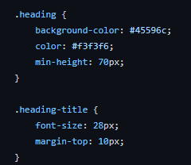
  
  ### Further Testing

-   The website has been tested on such browsers as: 
    -  Google Chrome [view](documentation/browser-screenshots/crome.pngchrome.png)
    -  Microsoft Edge [view](documentation/browser-screenshots/edge.pngedge.png)
    -  Firefox [view](documentation/browser-screenshots/firefox.pngfirefox.png)
-   The website was viewed on such devices as: 
     - Desktop [view](documentation/browser-screenshots/crome.png)
     - Laptop [view](#) NO LINK YET !!! !!!
     - Samsung Glaxy note 10 [view](documentation/device-screenshots/note-ten-chrome.jpgnote-ten.jpg)
     - Samsung tablet 3 [view](documentation/device-screenshots/tab-three.png)
-   A large amount of testing was done to ensure that all pages were linking correctly.
-   The website has been tested by friends and family members to review the site and documentation to point out any bugs and/ or user experience issues.

### Testing User Stories from User Experience (UX) section
- movie display multibal movies
## Known bugs
-  book and movie search lots of text - loader continues

### Changes made after UX, Design and Wireframes
- The navgation menu colour were change for the white text contrast with the backgrounds. 
- The movie search page was originaly going to dispaly one result but it was decided to change it to display more.
    - Before Change
    ####  
    - After change
    ####  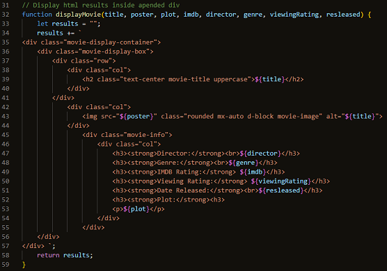  

## Deployment
***
The project was deployed to GitHub Pages using the following steps...

1. Log in to GitHub and locate the [GitHub Repository](https://github.com/Ed-Whyatt/cotswold-book-and-movie-club-ms2)
2. At the top of the Repository (not top of page), locate the "Settings" Button on the menu.
3. Scroll down the Settings page until you locate the "GitHub Pages" Section.
4. Under "Source", click the dropdown called "None" and select "Main Branch".
5. The page will automatically refresh.
6. Scroll back down through the page to locate the now published site [link](https://github.com/Ed-Whyatt/cotswold-book-and-movie-club-ms2/deployments/activity_log?environment=github-pages) in the "GitHub Pages" section.

### Forking the GitHub Repository

By forking the GitHub Repository we make a copy of the original repository on our GitHub account to view and/or make changes without affecting the original repository by using the following steps...

1. Log in to GitHub and locate the [GitHub Repository](https://github.com/Ed-Whyatt/cotswold-book-and-movie-club-ms2.git)
2. At the top of the Repository (not top of page) just above the "Settings" Button on the menu, locate the "Fork" Button.
3. You should now have a copy of the original repository in your GitHub account.

### Making a Local Clone

1. Log in to GitHub and locate the [GitHub Repository](https://github.com/Ed-Whyatt/cotswold-book-and-movie-club-ms2)
2. Under the repository name, click "<> Code" and click the second "code" dropdown menu. 
3. To clone the repository using HTTPS, click the second "code ▼" dropdown menu, copy the link [HTTPS link](https://github.com/Ed-Whyatt/cotswold-book-and-movie-club-ms2.git).
4. Open Git Bash
5. Change the current working directory to the location where you want the cloned directory to be made.
6. Type `git clone`, and then paste the URL you copied in Step 3.

$ git `clone https://github.com/Ed-Whyatt/cotswold-book-and-movie-club-ms2.git`

7. Press Enter. Your local clone will be created.

```
git clone https://github.com/Ed-Whyatt/cotswold-book-and-movie-club-ms2.git
Cloning into CI-Clone...
remote: Counting objects: 10, done.
remote: Compressing objects: 100% (8/8), done.
remove: Total 10 (delta 1), reused 10 (delta 1)
Unpacking objects: 100% (10/10), done.
```

Click [Here](https://help.github.com/en/github/creating-cloning-and-archiving-repositories/cloning-a-repository#cloning-a-repository-to-github-desktop) to retrieve pictures for some of the buttons and more detailed explanations of the above process.

Alternatively, if using Gitpod, you can click below to create your own workspace using this repository.

[](https://gitpod.io/#https://github.com/Ed-Whyatt/cotswold-book-and-movie-club-ms2)


## Credits
***

###  Code

   -   [Code Institute](https://codeinstitute.net/): Code Institutes lessons have help with all coding throughout this project.

   -   [Code Institute Sample README.md](https://github.com/Code-Institute-Solutions/SampleREADME): Code Institute Sample README.md has been used to help with readme layout.

   -   [Bootstrap4](https://getbootstrap.com/docs/4.4/getting-started/introduction/): Bootstrap Library used throughout the project mainly to make site responsive using the Bootstrap Grid System.

   -   [W3 Schools](https://www.w3schools.com/): W3 Schools has been used with some elements in this project.

   -   [Autoprefixer](https://autoprefixer.github.io/): Autoprefixer has been used with the images in css for Crapple/Apple/iOS fallback browsers.

   -   [Pixabay](https://pixabay.com) : Pixabay images have been used to show for the movie and book search pages background and placeholder images.

   - [Stockvault](https://www.stockvault.net) : Has been used for the image of a apple on a book in the main home page.

   - [Hover.css](http://ianlunn.github.io/Hover/) Has been used for the hover book turn page and word pop effect on the navgation menu.

 - ### Tutorials used
    - ####  Google Cluster Maps for maps.js
      #### Google maps cluster documentation - [view](https://developers.google.com/maps/documentation/javascript/marker-clustering)
    - #### root tech How to Program Web App Using Google Book API used to help with book-app.js
      #### root tech YouTube - [view](https://www.youtube.com/watch?v=uaMMkaa-P_A&list=PLv3FkN9_9-cvHY-oSLsSFL9OwRalG793b&index=2)
    - #### Coding Shiksha Build a Movie Info App in Javascript and Boostrap Using OMDb API used to help with movie-app.js     
      #### Coding Shiksha Youtube - [view](https://www.youtube.com/watch?v=8iuPNq553U0)


### Content
   -   All content was written by the developer.

### Acknowledgments

   -	My mentor for continuous helpful feedback.
   -	Tutor support at Code Institute.
   -	Support from staff at The City of Bristol collage.
   -	Members on Code Institutes Slack.
