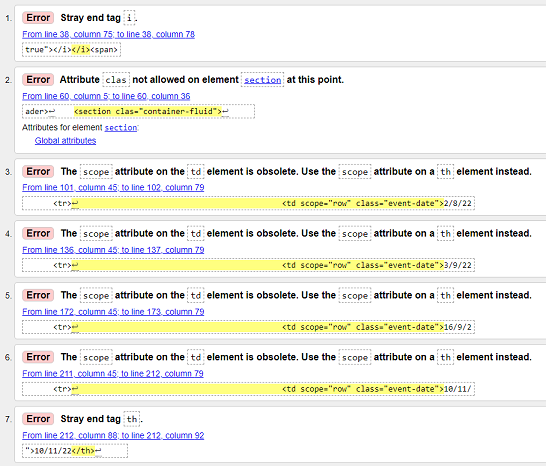
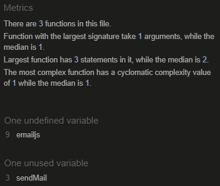

# Testing

## JEST
- ### Jest - [Link](https://jestjs.io/)
1. ### Initialising Jest
#### In terminal in GitPod.io workspace type:
    npm init
#### Click enter untill you get to test command and type jest:
    test command: jest
#### Then keep clicking enter untill the end when is display yes click and  enter to install jest.
2. ### Installing Jest
#### In the terminal in GitPod.io workspace type:
     npm install ---save-dev jest@26.6.3
#### Click enter and it will install. For a more detailed exapmle go to [Jest: Documentation](https://jestjs.io/docs/getting-started).
3. ### Using Jest
### I will be useing Jest to do some tests on the navgation app only this is a key function in the use of the website in a mobile view. I fully acknowledge and understand that, in a real-world scenario, an extensive set of Jest tests would be more comprehensive.
- Testing the Dom research in using Jest [Documentation](https://jestjs.io/docs/tutorial-jquery)
   - Jest Tests done in git enviroment.
   1. Mock HTML file for testing purposes.
      ### 
   2. Jest code used for testing the DOM of the button click function used in the navgation app.
   - ### nav-toggle-app.js 
     ### 
   - ### nav.toggle.app.test.js
     ### 
   4. Get Jest test results by typing npm test in the terminal while in the git enviroment.
                 
          npm test

      ### 

## W3C Markup Validator - [Link to site](https://validator.w3.org/#validate_by_uri).
The W3C Markup Validator and W3C CSS Validator Services were used to validate every page of the project to ensure there were no syntax errors in the project. The most substantial bugs that were fixed are in the bu fixed section below testing in README.md.

-   ### [W3C Markup Validator](https://validator.w3.org/#validate_by_uri)

-   ### Home page 
1. Initial test.
    ### 
2. Test after bugs fixed.
    ### 

-   ### Movie Search Page 
1. Initial test.
    ### 
2. Test after bugs fixed.
    ### 

-   ### Book Search Page
1. Initial test.
    ### 
2. Test after bugs fixed.
    ### 

-   ### contact Us
1. Initial test no bugs to fix after test was done.
    ### 

-   ### Toggle app test html page for testing with jest toggle_app-test.html
1. ### 

-   ### [W3C CSS Validator](https://jigsaw.w3.org/css-validator/#validate_by_input)
2. Test after the needed bugs fixed.
    ### 

## JSHint - [Link to site](https://jshint.com/)
JSHint  Services were used to validate every JavaScript page of the project to ensure there were no major syntax errors in the project. The most substantial bugs that were fixed are in the bu fixed section below testing in README.md.

### Book search app book-app.js
1.  Initial test.
## 
2. Test after needed bugs fixed.
## 

### Maps maps.js 
1.  Maps test, I decide not to change anything as most of the code is from the documentation. [link to documentation](https://developers.google.com/maps/documentation/javascript/marker-clustering).
### 

### Movie app movie-app.js
1.  Initial test.
### 
2. Test after the needed bugs fixed the api key is in a seprate app movie-app.api.js.
### 
3. movie-app-api.js is the function used for the app key
### 

### Nav toggle App nav-toggle-app.js
1.  Initial test.
### 
2. Test after the needed bugs fixed in bugs fixed section below.
### 
3. Jest nav.toggle.app.test.js used to test some of the nav toggle app i have not chnged anuy because this is a jest test.
### 

### Send Email send-email.js
### 

## Google Chrome Developer Tools
Google Chrome Developer Tools has been used throughout the development of this page, To use it in Google Crome browser Right click anywhere on the screen and click inspect on the menu.

### Google Chrome Developer Tool Lighthouse results
#### Home Page
1.  Initial test.
### 
2. Test after bugs fixed and genral inprovments.
### 

#### Search For Movie Page
1.  Initial test.
### 
2. Test after bugs fixed and genral inprovments.
### 

#### Search for Book Page
1.  Initial test.
### 
2. Test after bugs fixed and genral inprovments.
### 

#### Contact Us Page
1.  Initial test.
### 
2. Test after bugs fixed and genral inprovments.
### 

Some tests that lighthouse testing revealed are external and i have not changed them here are some that stand out.
1. The JQuary library shows as a medium securty risk.
### 
2. 
The Google Maps Street view image displays with incorrect aspect ratio.
### 