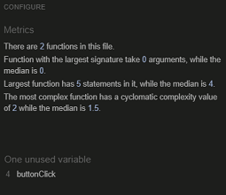
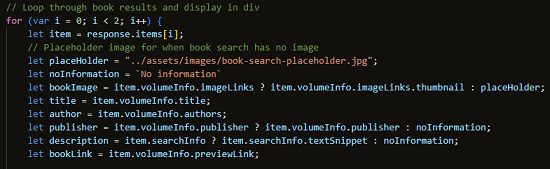

# Testing

## JEST
- ### Jest - [Link](https://jestjs.io/)
1. ### Initialising Jest
#### In terminal in GitPod.io workspace type:
    npm init
#### Click enter until you get to test command and type jest:
    test command: jest
#### Then keep clicking enter until the end when is display yes click and  enter to install jest.
2. ### Installing Jest
#### In the terminal in GitPod.io workspace type:
     npm install ---save-dev jest@26.6.3
#### Click enter and it will install. For a more detailed example go to [Jest: Documentation](https://jestjs.io/docs/getting-started).
3. ### Using Jest
### I will be using Jest to do some tests on the navigation app only this is a key function in the use of the website in a mobile view. I fully acknowledge and understand that, in a real-world scenario, an extensive set of Jest tests would be more comprehensive.
- Testing the Dom research in using Jest [Documentation](https://jestjs.io/docs/tutorial-jquery)
   - Jest Tests done in git environment.
   1. Mock HTML file for testing purposes.
      ### 
   2. Jest code used for testing the DOM of the button click function used in the navigation app.
   - ### nav-toggle-app.js 
     ### 
   - ### nav.toggle.app.test.js
     ### 
   4. Get Jest test results by typing npm test in the terminal while in the git environment.
                 
          npm test

      ### 

## W3C Markup Validator - [Link to site](https://validator.w3.org/#validate_by_uri).
The W3C Markup Validator and W3C CSS Validator Services were used to validate every page of the project to ensure there were no syntax errors in the project. The most substantial bugs that were fixed are in the bu fixed section below testing in README.md.

-   ### [W3C Markup Validator](https://validator.w3.org/#validate_by_uri)

-   ### Home page 
1. Initial test.
    ### 
2. Test after bugs fixed.
    ### 

-   ### Movie Search Page 
1. Initial test.
    ### 
2. Test after bugs fixed.
    ### 

-   ### Book Search Page
1. Initial test.
    ### 
2. Test after bugs fixed.
    ### 

-   ### contact Us
1. Initial test no bugs to fix after test was done.
    ### 

-   ### Toggle app test html page for testing with jest toggle_app-test.html
1. ### 

-   ### [W3C CSS Validator](https://jigsaw.w3.org/css-validator/#validate_by_input)
2. Test after the needed bugs fixed.
    ### 

## JSHint - [Link to site](https://jshint.com/)
JSHint  Services were used to validate every JavaScript page of the project to ensure there were no major syntax errors in the project. The most substantial bugs that were fixed are in the bug fixed section below testing in README.md.

### Book search app book-app.js
1.  Initial test.
## 
2. Test after needed bugs fixed.
## 

### Maps maps.js 
1.  Maps test, I decide not to change anything as most of the code is from the documentation. [link to documentation](https://developers.google.com/maps/documentation/javascript/marker-clustering).
### 

### Movie app movie-app.js
1.  Initial test.
### 
2. Test after the needed bugs fixed the API key is in a separate app movie-app.api.js.
### 
3. movie-app-api.js is the function used for the app key
### 

### Nav toggle App nav-toggle-app.js
1.  Initial test.
### 
2. Test after the needed bugs fixed in bugs fixed section below.
### 
3. Jest nav.toggle.app.test.js used to test some of the nav toggle app I have not changed any because this is a jest test.
### 

### Send Email send-email.js
### 

## Google Chrome Developer Tools
Google Chrome Developer Tools has been used throughout the development of this page, To use it in Google Crome browser Right click anywhere on the screen and click inspect on the menu.

### Google Chrome Developer Tool Lighthouse results
#### Home Page
1.  Initial test.
### 
2. Test after bugs fixed and general improvements.
### 

#### Search For Movie Page
1.  Initial test.
### 
2. Test after bugs fixed and general improvements.
### 

#### Search for Book Page
1.  Initial test.
### 
2. Test after bugs fixed and general improvements.
### 

#### Contact Us Page
1.  Initial test.
### 
2. Test after bugs fixed and general improvements.
### 

Some tests that lighthouse testing revealed are external and I have not changed them here are some that stand out.
1. The JQuary library shows as a medium security risk.
### 
2. 
The Google Maps Street view image displays with incorrect aspect ratio.
### 

## Bugs Fixed
1. Colour contrast
### The colours chosen for the Home and Search for Movie navigation button where of to low contract and have been changed.
- Before fix:
####  
- After fix:
####  
- Navigation colours after fix:
#### 
2. The locations in the upcoming events section were flowing out of the container when viewed on an extra small screen on all events. I put the locations section in its own column to prevent this.
- Before fix
####  
- After fix 
####  
3. There was a gap on the right-hand side of every page that was causing the page to show an unwanted horizontal scroll bar.
- Before fix same code for all pages.
####  
- After fix same code for all pages.
####  
4. The description in the book search results displayed was to long so I originally put a slice function in to reduce the size. Crome development tools showed an error, so I changed the information displayed to the book text snippet instead of the book description in the array of results from the Google Book API.
- Book search Crome development tool error in console.
#### 
- Code before fix in book-app.js
####  
#### 
- Code after fix in book-app.js
####  
####  
5. Crome Dev Tool showed a readability issue with the search bar in both the movie and book search pages. I’m removed the h1 heading and used the label for the heading changes are the same for both pages.
- Crome Dev Tool Readability
#### 
- Before fix
#### 
- After fix
#### 
6. Crome Dev Tool showed type error when reading textSnippet form the Google Book API results array. I Added some Ternary statement withing the html code to be displayed in the book-app.js, so it would have a fallback message when no results are found.
- Book search Crome development tool error in console.
#### 
- Before fix
#### 
- After fix
#### 
7. Crome Dev Tool showed a Get http 404 error from the image in the movie-app.js when the OMDb API movie poster was called so I added some Ternary statements to the poster results for a fall-back placeholder image to show.
- Book search Crome development tool error in console.
   #### 
- Before fix
   #### 
- After fix
   #### 
8. The heading and footer took up too much real estate on the page in small device view, so I changed the html with bootstrap columns and CSS using media queries.
- Small view and CSS before fix
  ####  
- Html Changes
  #### 
- Small view and CSS that media queries will change at max width 500px.
  ####  
  
  ### Further Testing

-   The website has been tested on such browsers as: 
    -  Google Chrome [view](documentation/browser-screenshots/crome.pngchrome.png)
    -  Microsoft Edge [view](documentation/browser-screenshots/edge.pngedge.png)
    -  Firefox [view](documentation/browser-screenshots/firefox.pngfirefox.png)
-   The website was viewed on such devices as: 
     - Desktop [view](documentation/browser-screenshots/crome.png)
     - Laptop [view](#) NO LINK YET !!! !!!
     - Samsung Galaxy note 10 [view](documentation/device-screenshots/note-ten-chrome.jpgnote-ten.jpg)
     - Samsung tablet 3 [view](documentation/device-screenshots/tab-three.png)
-   A large amount of testing was done to ensure that all pages were linking correctly.
-   The website has been tested by friends and family members to review the site and documentation to point out any bugs and/ or user experience issues.

### Know bugs

### Testing User Stories from User Experience (UX) section in README.md

- ### First time user goals
    1. As a First Time User, I want to see information on the events and when the next event is on and where.

    - When entering the site, customers are automatically greeted with an easily readable navigation bar with a clear navigation button that will take them back to the events on all pages.
    ###  
      
    - ### On a small device there is a three-bar button that opens the navigation menu witch will take them to the events page.
     ### 

    - Alternatively, they can scroll down the page to the events section.
    ###  
    ###    
 
    2. As a First Time User, I want to navigate the website easily and interact with the content.

    - The user has lots of options to easily navigate to the search for a movie, search for a book, contact us pages and events section from the navigation on all pages. Witch becomes a drop-down menu in small screen view.
    
     

    - On the home page there is a google maps map with clusters of the locations of the events which can be clicked on to zoom in and out.
     
       

    - On the Movie search page, the user can search for a movie and view the contents displayed.
    ### 
    

    - On the Book search page, the user can search for a and book, view the content displayed and click on a read book button that takes them to an external page with the book on it.
    ### 
    
    

    - On the contact page the user can fill in the form with their information and query that will be submitted to an external email. There is also a message displayed with the send response of either sent of error on it.
    
    - Message sent
    
    - Message error
    

    3. As a First Time User, I want to easily navigate to make an enquiry.
    - A user can easily navigate to the contact us page to fill in the form to make an inquiry by using the navigation bar or button on a small screen.
     
      
     

    4. As a First Time User, I want to easily navigate to the movie search page.
    - A user can easily navigate to the movie search page buy using the navigation bar or button on a small screen from all pages.
    
      

    5. As a First Time User, I want to easily navigate to the book search page.
     - A user can easily navigate to the movie search page buy using the navigation bar or button on a small screen from all pages.
     
      

- ### Returning user goals
    1. As a Returning User, I want to see all the upcoming book and movie events.
    
    - A returning user can easily navigate to the upcoming events in the events section of the home page and see when they are on by using the navigation menus.
    

    - A returning can easily see the upcoming events locations by navigating to the events maps section and using the interactive map clusters.
    

    2. As a Returning User, I want to send a contact message.

    - A returning user can easily navigate to the contact form on the contact us page.
    
    

    - A returning user can easily see were to fill in the form and what button to click to send.
    

    - A returning user can easily se a response message when the form has been submitted clear stating if sent or there was an error.
    - Message sent
    ### 
    - Message error
    ### 

    3. As a Returning User, I want to navigate to the club’s social media.

    - A returning user can easily navigate to the club's social media located at the bottom of the page in the footer.
    

    - A returning user can easily click on the social media lick they want to view and it will open in a new window.
    
- ### Frequent user goals
    1. As a Frequent user, I want to easily search for a book.

    - A Frequent user can easily navigate back to the search for book page using the navigation menu.
    
    

    - A Frequent user can easily search for a book in by using the search for a book search bar.
    

    2. As a Frequent user, I want to easily search for a movie.

     - A Frequent user can easily navigate back to the search for movie page using the navigation menus and entering a book of there choice.
     
    

    - A Frequent user can easily search for a book in by using the search for a movie search bar and entering a movie of there choice.
    

    3. As a Frequent user, I want to see the current book and movie events.

     - A Frequent user can easily navigate back to the book and movie events located in the home page by using the navigation menus or scrolling down to the menu section.
     
     
     

     

